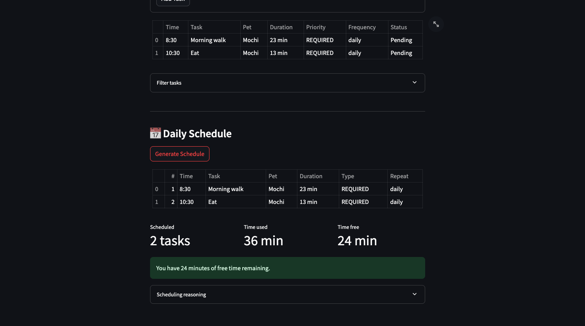

# PawPal+ — Applied AI System (Module 4)

> A pet care scheduling assistant with a **RAG-powered AI advisor** that gives personalized advice grounded in a curated pet-care knowledge base **and** the owner's live pet/schedule data.

## Base Project (Modules 1–3)

This project extends **PawPal**, the pet care scheduler I built in Modules 1–3.

The original PawPal was a Python/Streamlit app organized around four classes (`Owner`, `Pet`, `Task`, `Scheduler`) that produced a daily care plan from priority-based rules and a hard time budget — required tasks (e.g. medication) scheduled first, then optional tasks filling remaining time, with conflict detection on overlapping start times and chronological sorting of `"HH:MM"` slots. It supported multiple pets per owner, recurring (daily/weekly) tasks, filtering by pet/status, and an `explain_plan()` reasoning log so the user could see *why* each scheduling decision was made. **PawPal+** keeps all of that intact and adds a Retrieval-Augmented Generation layer on top.

## What's New in PawPal+ (Module 4)

The Module 4 extension is a **RAG-powered AI Pet Care Advisor** that lives as a second tab inside the existing Streamlit app. It is fully integrated, not a side script:

- A **knowledge base** of six markdown documents (nutrition, health, grooming, exercise, medication, training) is chunked and indexed with TF-IDF.
- When the user asks a question, the **RAG engine** retrieves the top-k most relevant chunks via cosine similarity.
- The **AI Advisor** combines the retrieved knowledge with the user's **live `Owner` state** — pet profiles, current task list, and freshly-generated schedule — and sends the combined prompt to the HuggingFace Inference API (Llama-3.1-8B-Instruct).
- A **layered guardrail system** validates input (length, topic), and post-processes output (length cap, dosage-safety disclaimer) before showing the answer.
- An **evaluation harness** (`eval_rag.py`) tests retrieval quality and guardrail behavior on predefined inputs and prints a pass/fail summary.

The advisor materially changes system behavior: questions about a 10-year-old cat get senior-cat-specific answers because the prompt includes that pet's actual age, and questions about scheduling reference the actual conflicts the scheduler flagged.

## System Architecture


The diagram (and the matching mermaid source in [assets/uml_final.md](assets/uml_final.md)) shows the two halves of the system:

- **Core scheduler** (left) — `Owner` owns one or more `Pet`s, each `Pet` has `Task`s, and `Scheduler` reads the `Owner` to produce `daily_plan`, `skipped_tasks`, `conflicts`, and `reasoning`.
- **RAG pipeline** (right) — the user question flows through input guardrails, into `RAGEngine` (which has already loaded and TF-IDF-indexed the `knowledge_base/`), through `AIAdvisor` (which adds live pet + schedule context), out to the HuggingFace API, and back through output guardrails before the Streamlit UI renders it.

### Components

| Component | File | Role |
|---|---|---|
| Streamlit UI | [app.py](app.py) | Two-tab interface — **Schedule** tab and **AI Advisor** chat tab |
| Core domain model | [pawpal_system.py](pawpal_system.py) | `Owner`, `Pet`, `Task`, `Scheduler` |
| RAG engine | [rag_engine.py](rag_engine.py) | Markdown chunking, TF-IDF indexing, cosine-similarity retrieval |
| AI advisor | [ai_advisor.py](ai_advisor.py) | Guardrails + retrieval + context-building + LLM call |
| Knowledge base | [knowledge_base/](knowledge_base/) | Six topic-organized markdown documents |
| Evaluation harness | [eval_rag.py](eval_rag.py) | Standalone script — 23 retrieval/guardrail tests + optional end-to-end tests |
| Test suite | [tests/](tests/) | 48 pytest tests across scheduler and RAG |

## Setup Instructions

### 1. Clone and create a virtual environment

```bash
git clone https://github.com/AbtinK-2234/applied-ai-system-project.git
cd applied-ai-system-project
python -m venv .venv
source .venv/bin/activate          # Windows: .venv\Scripts\activate
pip install -r requirements.txt
```

### 2. Provide a HuggingFace Inference API token

The AI Advisor tab needs a free [HuggingFace token](https://huggingface.co/settings/tokens). Put it in a `.env` file in the project root:

```
HF_TOKEN=hf_your_token_here
```

> The scheduling tab works without the token — only the AI Advisor tab requires it.

### 3. Run the app

```bash
streamlit run app.py
```

Streamlit will open the app at `http://localhost:8501`.

### 4. Run the test suite

```bash
python -m pytest                   # 48 unit/integration tests
python eval_rag.py                 # 23 retrieval + guardrail tests, no API key needed
python eval_rag.py --full          # adds end-to-end tests against the live API (needs HF_TOKEN)
```

## Demo Walkthrough

**Loom video walkthrough:** _[paste Loom URL here once recorded]_ — a 5–7 minute walkthrough of PawPal+ running end-to-end, covering the Schedule tab, the AI Advisor tab, and the three sample interactions below.

The screenshot below shows PawPal+ running end-to-end — the Schedule tab with pets and tasks loaded on the left, and the AI Advisor chat producing personalized advice on the right.



### Sample Interactions

These are real responses from the running system. Each one demonstrates the AI feature actively shaping behavior — pulling from retrieved knowledge **and** from live app state.

#### Example 1 — Personalized nutrition advice (RAG + live pet context)

**Setup:** Owner *Jordan* has a 3-year-old dog named *Mochi* with a daily morning walk task scheduled at 08:00.

**Input:**
> What should I feed Mochi based on his age?

**Output:**
> Based on your pet profiles, Mochi is a 3-year-old adult dog. Here are my nutrition recommendations:
>
> - **Meal frequency**: Adult dogs do well with 2 meals per day
> - **Portion size**: Adjust based on Mochi's weight — medium dogs (10–25 kg) typically need 1–2 cups of dry food per day
> - **Key nutrients**: Ensure the diet includes 18–25% protein and 10–15% fats
> - **Hydration**: Provide 30–50 ml of water per kg of body weight daily
> - **Treats**: Keep treats under 10% of daily calories — great for training reinforcement on your morning walks
>
> *I'd recommend consulting your veterinarian for precise portions based on Mochi's exact weight and activity level.*

Notice that the advisor names *Mochi* directly, infers *adult* from age 3, and ties treats back to the *morning walks* it can see in the schedule.

#### Example 2 — Off-topic question (input guardrail)

**Input:**
> What is the capital of France?

**Output:**
> I'm the PawPal+ Pet Care Advisor, and I can only help with pet-related questions — things like nutrition, health, grooming, exercise, training, medication, and scheduling. Could you rephrase your question to be about your pet's care?

The keyword-based topic filter catches this before any retrieval or API call happens, so no tokens are spent on off-topic prompts.

#### Example 3 — Dosage safety guardrail (output guardrail)

**Setup:** Owner asks about flea medication for an adult dog.

**Input:**
> How much carprofen should I give my dog?

**Output (excerpt):**
> Carprofen is commonly prescribed for inflammation and pain. Typical labels suggest dosing around 2 mg per pound of body weight daily, but the exact amount depends on weight, age, and whether other medications are involved.
>
> **Important:** The dosage information above is for general reference only. Always consult your veterinarian for the correct dosage for your specific pet.

The output regex detects the dose-shaped phrasing and appends the vet-consult disclaimer automatically.

## Design Decisions

### Why TF-IDF instead of a vector database

The first AI suggestion was ChromaDB + sentence-transformers. I rejected it: those dependencies pull in `torch` and `transformers` (~2 GB), make the project meaningfully harder to install, and don't measurably improve accuracy on a keyword-rich domain like pet care. TF-IDF with 1–2 grams and English stop-words handles all six source-routing eval queries correctly while installing in seconds.

### Why topic-organized (not species-organized) knowledge

Files are split by **topic** (`nutrition.md`, `health.md`, …) rather than by **species** (`dog.md`, `cat.md`). This means a query like "dog grooming" pulls grooming-relevant content directly instead of dragging in unrelated dog material. Retrieval evals confirm the topic split routes queries to the right source on every test case.

### Why layered, additive guardrails

`validate_input` → `check_topic_relevance` → retrieval → LLM → `validate_output` are independent layers, each dumb enough to test in isolation. The output guardrail only **adds** content (a disclaimer) — it never edits or replaces the model's response — so the user always sees the original text plus the warning. Composability beats cleverness here.

### Why live state in the prompt

The advisor isn't a generic Q&A bot — it sees the actual `Owner`, `Pet`, and `Scheduler.daily_plan`. This is the integration: a question about exercise will retrieve exercise guidance **and** read the actual scheduled walks. Removing this would reduce the advisor to a stock chatbot.

### Tradeoffs accepted

- **Keyword-based topic filter** can false-reject legitimate questions that lack pet-care vocabulary. An embedding classifier would be better but adds dependencies.
- **No conversation memory** — each question is independent. A follow-up like "and for cats?" loses context. Acceptable for the demo scope.
- **Static knowledge base** — adding new pet care information requires editing markdown and restarting. Fine for a single-user app, would not scale to a service.

## Testing Summary

### `pytest` — 48 tests passing

Organized into 12 groups covering the original scheduler (Modules 1–3) and the new RAG layer:

| Group | What it covers |
|---|---|
| `TestTaskCompletion` / `TestTaskAddition` | `mark_complete()`, add/remove on pets, pet-name stamping |
| `TestScheduler` | Required-first scheduling, time-budget enforcement |
| `TestSortingAndFiltering` | Chronological sort, filter by pet, filter by status |
| `TestRecurringTasks` | Daily/weekly recurrence, attribute preservation, one-time returns None |
| `TestConflictDetection` | Overlapping vs. non-overlapping times |
| `TestEdgeCases` | Zero time, exact-fit, completed exclusion, multi-pet interleaving |
| `TestKnowledgeBaseLoading` / `TestChunking` | Load all docs, drop tiny chunks, preserve source metadata |
| `TestRetrieval` | Top-k correctness, empty index, irrelevant-query handling |
| `TestContextBuilding` / `TestAdvisorInit` | Context strings from live state, init with/without API key |

### `eval_rag.py` — 23/23 passing (no API key required)

```
PawPal+ RAG Evaluation
==================================================
=== Retrieval Quality ===
  [PASS] Knowledge base loads — 104 chunks
  [PASS] Dog nutrition query retrieves nutrition.md
  [PASS] Cat grooming query retrieves grooming.md
  [PASS] Vaccination query retrieves health.md
  [PASS] Exercise query retrieves exercise.md
  [PASS] Medication query retrieves medication.md
  [PASS] Training query retrieves training.md
=== Guardrails ===
  [PASS] Empty input rejected
  [PASS] Off-topic blocked: 'What is the capital of France?'
  [PASS] Dosage triggers vet disclaimer
  [PASS] Long output truncated
  ... (all 23 passing)
==================================================
RESULTS: 23/23 passed, 0 failed
```

### What worked

- All six source-routing queries hit the correct knowledge file on the first attempt — the topic-organized split is the main reason.
- Guardrails compose cleanly because each layer is independently testable.
- Live app context measurably improves answers (the model references pet names, ages, and scheduled times in its replies).

### What didn't work

- The first chunking heuristic produced ~180 chunks, many of them tiny fragments (single bullets, broken list items). Dropping anything under 30 chars and adding 100-char overlap cut chunk count to 104 useful chunks with no loss in retrieval coverage.
- The keyword topic filter occasionally false-rejects legitimate-but-keyword-poor questions (e.g., "Can he eat grapes?"). Documented as a known limitation.

### What I learned

The biggest lesson is methodological: **AI is most useful as a reviewer, not a generator.** Asking the model to critique my existing skeleton produced concrete, actionable improvements I would have missed; asking it to generate code from a blank prompt produced something serviceable but generic. The full reflection — including AI collaboration, biases, and a deeper testing breakdown — is in [model_card.md](model_card.md).

## Logging and Guardrails

### Logging

Every layer (`rag_engine`, `ai_advisor`, `app`) uses Python's `logging` module. Sample output:

```
2026-04-15 10:32:01 [rag_engine] INFO: Loaded 18 chunks from nutrition.md
2026-04-15 10:32:01 [ai_advisor] INFO: AI Advisor initialised (104 knowledge chunks)
2026-04-15 10:32:15 [ai_advisor] INFO: Processing question: What should I feed Mochi?
2026-04-15 10:32:15 [ai_advisor] INFO: Retrieved 4 chunks from: ['nutrition.md']
2026-04-15 10:32:17 [ai_advisor] INFO: Generated response (412 chars, 1823 input tokens, 156 output tokens)
```

### Guardrails

| Guardrail | What it does |
|---|---|
| **Input length** | Rejects empty (< 3 char) or oversized (> 500 char) questions before any work happens |
| **Topic relevance** | Keyword match against an allowlist; off-topic questions get a polite redirect (no API call) |
| **Knowledge fallback** | If retrieval finds nothing, the prompt tells the model to say so rather than guess |
| **Output length cap** | Truncates responses over 3000 chars at a sentence boundary |
| **Dosage disclaimer** | Regex detects medication-dose phrasings and appends a vet-consult warning |
| **API error handling** | Catches auth, rate-limit, and generic API errors; returns a user-friendly message |

## Reflection

A full reflection — covering how I used AI during development, one helpful and one flawed AI suggestion, biases in the data and the model, testing results, and future improvements — is in [model_card.md](model_card.md). The earlier Modules 1–3 design reflection is preserved in [reflection.md](reflection.md).

### Portfolio Reflection — What This Project Says About Me as an AI Engineer

PawPal+ shows the way I want to work as an AI engineer. I treat AI as a reviewer first and a generator second — the highest-leverage moments in this project came from asking the model to critique my existing code, not from asking it to write code from scratch. I take dependency cost seriously: I rejected the AI's first suggestion to use ChromaDB and sentence-transformers because TF-IDF was honest enough for the domain and let the project install in seconds. I build guardrails in layers I can test independently, I write evaluation harnesses (`eval_rag.py`) so reliability is measurable instead of assumed, and I keep the new AI feature wired into the live application state rather than bolted on as a side script. Most of all, I make the call on what to keep and what to reject — the model proposes, I decide.

## Repository Layout

```
applied-ai-system-project/
├── app.py                  # Streamlit UI (Schedule + AI Advisor tabs)
├── pawpal_system.py        # Owner / Pet / Task / Scheduler (Modules 1–3 core)
├── rag_engine.py           # TF-IDF retrieval over knowledge_base/
├── ai_advisor.py           # Guardrails + RAG + LLM call
├── eval_rag.py             # Evaluation harness (23 tests)
├── main.py                 # CLI demo (no UI)
├── knowledge_base/         # Six topic-organized markdown documents
├── tests/                  # 48 pytest tests
├── assets/                 # System diagram (UML), demo screenshot, mermaid source
│   ├── uml_final.png
│   ├── uml_final.md
│   └── demo_screenshot.png
├── model_card.md           # AI collaboration, biases, testing reflection (Module 4)
├── reflection.md           # Modules 1–3 design reflection
├── requirements.txt
└── .github/workflows/      # CI: pytest + eval_rag on every push
```
