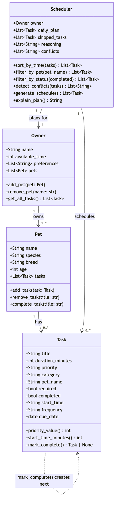

# PawPal+ (Module 2 Project)

**PawPal+** is a Streamlit app that helps a pet owner plan daily care tasks for their pets using priority-based scheduling, conflict detection, recurring task management, and an **AI-powered pet care advisor** built with Retrieval-Augmented Generation (RAG).

## Features

- **Owner & Pet profiles** — Set up your name, daily time budget, and add multiple pets with species and age
- **Task management** — Add tasks with title, duration, priority, category, start time, frequency, and required flag
- **Priority-based scheduling** — Required tasks (e.g. medication) are scheduled first, then optional tasks fill remaining time by priority
- **Time-based sorting** — Tasks with a `start_time` in `"HH:MM"` format are displayed in chronological order
- **Filtering** — View tasks filtered by pet name or completion status
- **Recurring tasks** — Daily and weekly tasks auto-generate the next occurrence when marked complete (using `timedelta`)
- **Conflict detection** — Overlapping time slots are flagged with warnings before the schedule is built
- **Schedule explanation** — Every scheduling decision (included, skipped, conflict) is logged and displayed as reasoning
- **AI Pet Care Advisor (RAG)** — Ask natural-language questions about pet care and get personalised advice powered by retrieval-augmented generation (see below)

## AI Feature: RAG-Powered Pet Care Advisor

The AI Advisor is fully integrated into the main app as a chat tab. It uses a **Retrieval-Augmented Generation** pipeline:

1. **Knowledge Base** — A corpus of pet care documents (`knowledge_base/`) covering nutrition, health, grooming, exercise, medication, and training.
2. **Retrieval** — When you ask a question, the RAG engine chunks the documents, indexes them with TF-IDF (via scikit-learn), and retrieves the most relevant passages using cosine similarity.
3. **Augmentation** — The retrieved knowledge is combined with your **live pet profiles, tasks, and generated schedule** from the app, so the AI has full context about your specific situation.
4. **Generation** — The combined prompt is sent to the HuggingFace Inference API, which produces a personalised, grounded answer.

This is not a standalone script — the AI advisor actively reads your app state (pets, tasks, schedule conflicts) and uses retrieved knowledge to formulate its response. For example, asking "Is my dog getting enough exercise?" will pull exercise guidelines from the knowledge base *and* check your dog's actual scheduled walks.

### Architecture

```
User Question
     |
     v
[RAG Engine] -- TF-IDF index over knowledge_base/*.md
     |  retrieve top-k relevant chunks
     v
[AI Advisor] -- combines: retrieved knowledge + pet profiles + live schedule
     |
     v
[HuggingFace Inference API] -- generates personalised answer
     |
     v
Streamlit Chat UI
```

### Key files

| File | Purpose |
|---|---|
| `rag_engine.py` | Document loading, chunking, TF-IDF indexing, cosine-similarity retrieval |
| `ai_advisor.py` | Orchestrates RAG pipeline + HuggingFace Inference API call with live app context |
| `knowledge_base/` | Markdown documents forming the retrieval corpus |
| `app.py` | Streamlit UI with Schedule tab and AI Advisor chat tab |

## Demo

To run the app locally:

```bash
streamlit run app.py
```


## System Architecture

The final UML class diagram reflecting all four classes and their relationships:



## Getting Started

### 1. Create a virtual environment and install dependencies

```bash
python -m venv .venv
source .venv/bin/activate  # Windows: .venv\Scripts\activate
pip install -r requirements.txt
```

### 2. Set your HuggingFace Inference API key

The AI Advisor requires a free [HuggingFace token](https://huggingface.co/settings/tokens). Create a `.env` file in the project root:

```bash
cp .env.example .env
# Then edit .env and paste your token
```

Or set it as an environment variable:

```bash
export HF_TOKEN='your-token-here'
```

> **Note:** The app works without the API key — the scheduling features are fully functional. Only the AI Advisor tab requires the key.

### 3. Run the app

```bash
streamlit run app.py
```

### 4. Use the AI Advisor

1. Set up your owner profile and add pets/tasks in the **Schedule** tab
2. Switch to the **AI Advisor** tab
3. Ask questions like:
   - "What should I feed my 3-year-old dog?"
   - "Is my cat's grooming schedule sufficient?"
   - "Are there any conflicts in my schedule I should worry about?"
   - "What vaccinations does my puppy need?"

## Sample Input/Output

### Example 1: Nutrition question (personalized to pet)

**Setup:** Owner "Jordan" has a 3-year-old dog named Mochi with a morning walk task.

**Input:** `What should I feed Mochi based on his age?`

**Output:**
> Based on your pet profiles, Mochi is a 3-year-old adult dog. Here are my nutrition recommendations:
>
> - **Meal frequency**: Adult dogs do well with 2 meals per day
> - **Portion size**: Adjust based on Mochi's weight — medium dogs (10-25 kg) typically need 1-2 cups of dry food per day
> - **Key nutrients**: Ensure the diet includes 18-25% protein and 10-15% fats
> - **Hydration**: Provide 30-50 ml of water per kg of body weight daily
> - **Treats**: Keep treats under 10% of daily calories — great for training reinforcement on your morning walks
>
> *I'd recommend consulting your veterinarian for precise portions based on Mochi's exact weight and activity level.*

### Example 2: Off-topic question (guardrail blocks it)

**Input:** `What is the capital of France?`

**Output:**
> I'm the PawPal+ Pet Care Advisor, and I can only help with pet-related questions — things like nutrition, health, grooming, exercise, training, medication, and scheduling. Could you rephrase your question to be about your pet's care?

### Example 3: Dosage safety guardrail

If the AI response includes a specific dosage like "give 10mg of carprofen daily", the output guardrail automatically appends:

> **Important:** The dosage information above is for general reference only. Always consult your veterinarian for the correct dosage for your specific pet.

## Evaluation Script

Run the RAG evaluation harness to verify retrieval quality and guardrail behavior:

```bash
python eval_rag.py                # retrieval + guardrail tests (no API key needed)
python eval_rag.py --full         # also runs end-to-end API tests (needs ANTHROPIC_API_KEY)
```

Sample output:
```
PawPal+ RAG Evaluation
==================================================
=== Retrieval Quality ===
  [PASS] Knowledge base loads — 104 chunks
  [PASS] Dog nutrition query retrieves nutrition.md
  [PASS] Cat grooming query retrieves grooming.md
  [PASS] Vaccination query retrieves health.md
  [PASS] Exercise query retrieves exercise.md
  [PASS] Medication query retrieves medication.md
  [PASS] Training query retrieves training.md
=== Guardrails ===
  [PASS] Empty input rejected
  [PASS] Off-topic blocked: 'What is the capital of France?'
  [PASS] Dosage triggers vet disclaimer
  ...
==================================================
RESULTS: 23/23 passed, 0 failed
All tests passed!
```

## Testing

Run the full test suite with:

```bash
python -m pytest
```

The suite contains **48 tests** organized into groups:

| Group | What it covers |
|---|---|
| `TestTaskCompletion` | `mark_complete()` changes status correctly |
| `TestTaskAddition` | Adding/removing tasks, pet name stamping |
| `TestScheduler` | Required-first scheduling, time-budget overflow |
| `TestSortingAndFiltering` | Chronological sort, filter by pet, filter by status |
| `TestRecurringTasks` | Daily/weekly recurrence, one-time tasks return None |
| `TestConflictDetection` | Overlapping times flagged, non-overlapping times clean |
| `TestEdgeCases` | No tasks, no pets, zero time, exact-fit, same start time, completed exclusion, safe removal, un-timed tasks sorted last, attribute preservation, multi-pet interleaving |
| `TestKnowledgeBaseLoading` | Loads all knowledge files, handles missing/empty directories |
| `TestChunking` | Splits on headings, drops tiny chunks, preserves source metadata |
| `TestRetrieval` | Returns relevant chunks, respects top-k, handles empty index and irrelevant queries |
| `TestContextBuilding` | Builds pet/schedule context strings from live app state |
| `TestAdvisorInit` | Initialisation with/without API key, API call structure verification |

## Logging and Guardrails

### Logging
The RAG engine, AI advisor, and app all use Python's `logging` module. Every retrieval, API call, and error is logged with timestamps. Example log output:

```
2026-04-15 10:32:01 [rag_engine] INFO: Loaded 18 chunks from nutrition.md
2026-04-15 10:32:01 [ai_advisor] INFO: AI Advisor initialised (104 knowledge chunks)
2026-04-15 10:32:15 [ai_advisor] INFO: Processing question: What should I feed Mochi?
2026-04-15 10:32:15 [ai_advisor] INFO: Retrieved 4 chunks from: ['nutrition.md']
2026-04-15 10:32:17 [ai_advisor] INFO: Generated response (412 chars, 1823 input tokens, 156 output tokens)
```

### Guardrails

| Guardrail | What it does | Example |
|---|---|---|
| **Input validation** | Rejects empty, too-short (< 3 chars), or too-long (> 500 chars) questions | `"hi"` → "Your question is too short." |
| **Topic relevance filter** | Blocks questions unrelated to pet care using keyword matching | `"What stocks should I buy?"` → polite redirect to pet topics |
| **Output length cap** | Truncates responses over 3000 chars with a note | Prevents runaway generation from flooding the UI |
| **Dosage safety disclaimer** | Detects medication dosage patterns and appends a vet-consult warning | `"give 10mg daily"` → disclaimer appended |
| **API error handling** | Catches auth errors, rate limits, and API failures gracefully | Returns user-friendly message instead of crashing |
| **Knowledge base fallback** | If no relevant chunks are found, the AI is told explicitly so it doesn't hallucinate | Response notes when advice is not grounded in the knowledge base |
