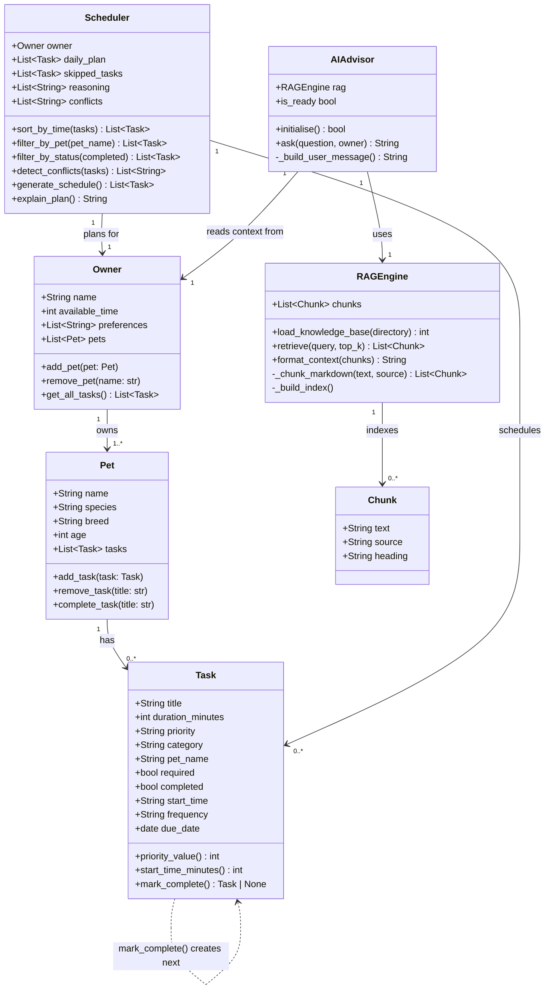
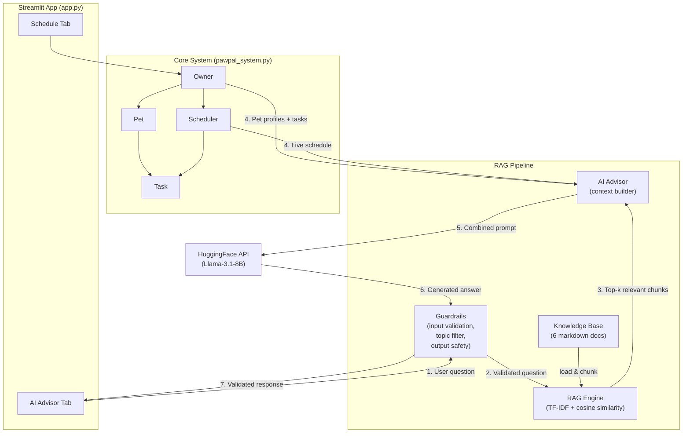

## Class Diagram

```mermaid
classDiagram
    class Task {
        +String title
        +int duration_minutes
        +String priority
        +String category
        +String pet_name
        +bool required
        +bool completed
        +String start_time
        +String frequency
        +date due_date
        +priority_value() int
        +start_time_minutes() int
        +mark_complete() Task | None
    }

    class Pet {
        +String name
        +String species
        +String breed
        +int age
        +List~Task~ tasks
        +add_task(task: Task)
        +remove_task(title: str)
        +complete_task(title: str)
    }

    class Owner {
        +String name
        +int available_time
        +List~String~ preferences
        +List~Pet~ pets
        +add_pet(pet: Pet)
        +remove_pet(name: str)
        +get_all_tasks() List~Task~
    }

    class Scheduler {
        +Owner owner
        +List~Task~ daily_plan
        +List~Task~ skipped_tasks
        +List~String~ reasoning
        +List~String~ conflicts
        +sort_by_time(tasks) List~Task~
        +filter_by_pet(pet_name) List~Task~
        +filter_by_status(completed) List~Task~
        +detect_conflicts(tasks) List~String~
        +generate_schedule() List~Task~
        +explain_plan() String
    }

    class RAGEngine {
        +List~Chunk~ chunks
        +load_knowledge_base(directory) int
        +retrieve(query, top_k) List~Chunk~
        +format_context(chunks) String
        -_chunk_markdown(text, source) List~Chunk~
        -_build_index()
    }

    class Chunk {
        +String text
        +String source
        +String heading
    }

    class AIAdvisor {
        +RAGEngine rag
        +initialise() bool
        +is_ready bool
        +ask(question, owner) String
        -_build_user_message() String
    }

    Owner "1" --> "1..*" Pet : owns
    Pet "1" --> "0..*" Task : has
    Scheduler "1" --> "1" Owner : plans for
    Scheduler "1" --> "0..*" Task : schedules
    Task ..> Task : mark_complete() creates next
    AIAdvisor "1" --> "1" RAGEngine : uses
    AIAdvisor "1" --> "1" Owner : reads context from
    RAGEngine "1" --> "0..*" Chunk : indexes
```

## System Architecture & Data Flow

```mermaid
flowchart TD
    subgraph UI["Streamlit App (app.py)"]
        ST["Schedule Tab"]
        AT["AI Advisor Tab"]
    end

    subgraph Core["Core System (pawpal_system.py)"]
        OW[Owner]
        PE[Pet]
        TA[Task]
        SC[Scheduler]
    end

    subgraph RAG["RAG Pipeline"]
        KB["Knowledge Base\n(6 markdown docs)"]
        RE["RAG Engine\n(TF-IDF + cosine similarity)"]
        GR["Guardrails\n(input validation,\ntopic filter,\noutput safety)"]
        AA["AI Advisor\n(context builder)"]
    end

    API["HuggingFace API\n(Llama-3.1-8B)"]

    ST --> OW
    OW --> PE
    PE --> TA
    OW --> SC
    SC --> TA

    AT -- "1. User question" --> GR
    GR -- "2. Validated question" --> RE
    KB -- "load & chunk" --> RE
    RE -- "3. Top-k relevant chunks" --> AA
    OW -- "4. Pet profiles + tasks" --> AA
    SC -- "4. Live schedule" --> AA
    AA -- "5. Combined prompt" --> API
    API -- "6. Generated answer" --> GR
    GR -- "7. Validated response" --> AT
```
