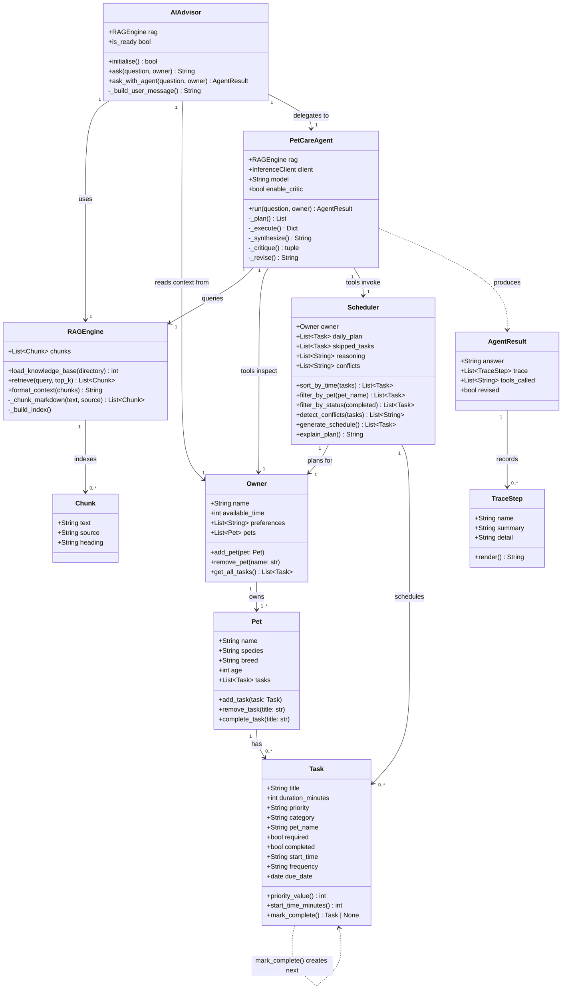
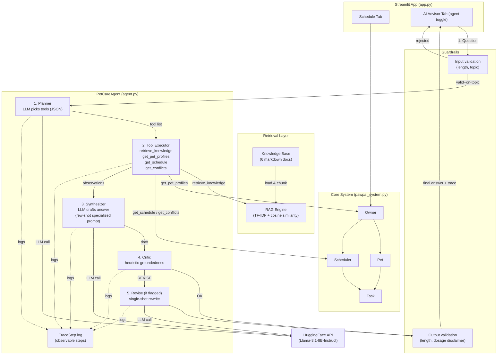

## Class Diagram

## System Architecture & Data Flow

## Evaluation Harness

Two evaluation scripts validate the system on predefined inputs and print pass/fail summaries. They are run by CI on every push.

| Script | Scope | Tests |
|---|---|---|
| `eval_rag.py` | Retrieval quality, guardrail behavior, optional end-to-end | 23 offline, +4 end-to-end with `--full` |
| `eval_specialization.py` | Baseline-vs-specialized prompt + output comparison | 6 offline structural checks, +per-question metrics with `--full` |
| `pytest tests/` | Scheduler (Modules 1–3), RAG, advisor, agent | 84 unit/integration tests |
