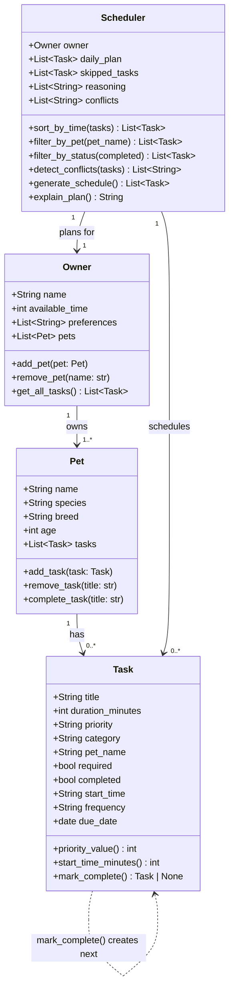

```mermaid
classDiagram
    class Task {
        +String title
        +int duration_minutes
        +String priority
        +String category
        +String pet_name
        +bool required
        +bool completed
        +String start_time
        +String frequency
        +date due_date
        +priority_value() int
        +start_time_minutes() int
        +mark_complete() Task | None
    }

    class Pet {
        +String name
        +String species
        +String breed
        +int age
        +List~Task~ tasks
        +add_task(task: Task)
        +remove_task(title: str)
        +complete_task(title: str)
    }

    class Owner {
        +String name
        +int available_time
        +List~String~ preferences
        +List~Pet~ pets
        +add_pet(pet: Pet)
        +remove_pet(name: str)
        +get_all_tasks() List~Task~
    }

    class Scheduler {
        +Owner owner
        +List~Task~ daily_plan
        +List~Task~ skipped_tasks
        +List~String~ reasoning
        +List~String~ conflicts
        +sort_by_time(tasks) List~Task~
        +filter_by_pet(pet_name) List~Task~
        +filter_by_status(completed) List~Task~
        +detect_conflicts(tasks) List~String~
        +generate_schedule() List~Task~
        +explain_plan() String
    }

    Owner "1" --> "1..*" Pet : owns
    Pet "1" --> "0..*" Task : has
    Scheduler "1" --> "1" Owner : plans for
    Scheduler "1" --> "0..*" Task : schedules
    Task ..> Task : mark_complete() creates next
```
